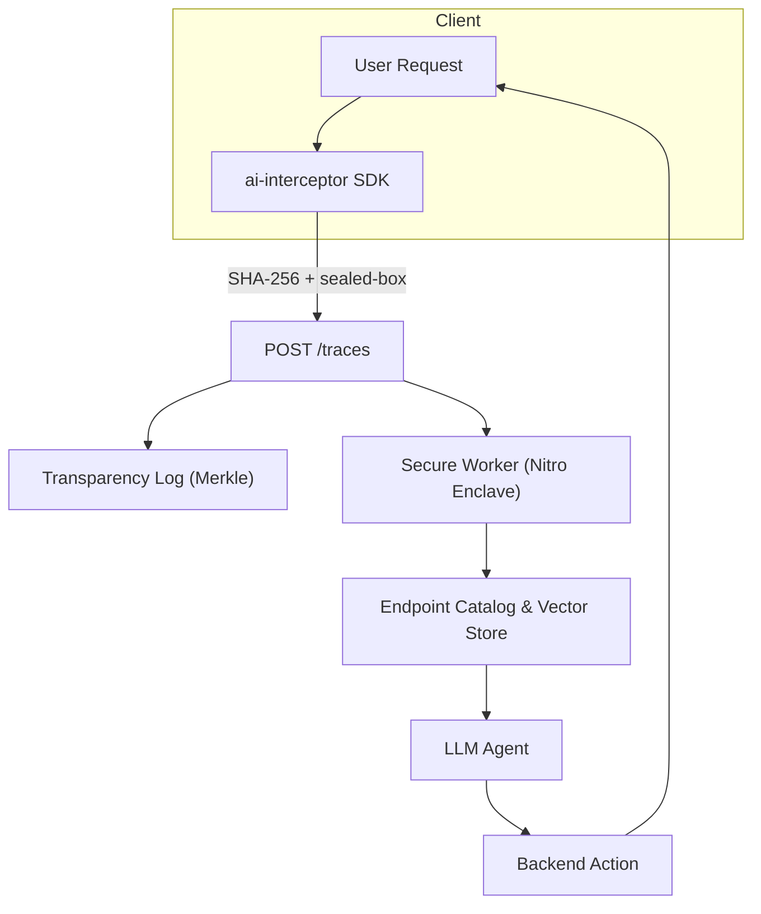

# @wapy-ai/interceptor

> **End‑to‑end‑encrypted traces & AI actions for any Node.js backend**

`interceptor` é um SDK que permite que você marque rotas ou resolvers e envie, de forma totalmente cifrada, os payloads dessas requisições para o **AI Cloud**. Lá, eles viram "tools" que um modelo LLM pode invocar (ex.: `createTag`). 

- **Opt‑in** : o _dev_ escolhe exatamente quais endpoints são observados.
- **E2EE** : selado com _libsodium sealed‑box_; só você possui a *private key*.
- **Transparência** : cada hash entra num log Merkle, auditável por CLI.
- **Zero‑latência perceptível** : intercepta em ~1 ms p99.

---

## ⚙️ Como funciona


1. **Intercepta** a request/resposta.
2. Gera `sha256(body)` e criptografa com sua _public key_.
3. Envia para `/traces`; o hash vira um *leaf* num log de transparência.
4. Um worker rodando em **AWS Nitro Enclave** descriptografa, infere schema e cadastra a _tool_.
5. Quando o usuário final pedir, o LLM chama `createTag` com os parâmetros corretos.

---

## 🔒 Segurança em detalhes

| Camada | Garantia | Tecnologia |
|--------|----------|------------|
| Confidencialidade | Só o dono da *private key* lê o payload | `crypto_box_seal` (libsodium) |
| Integridade | Qualquer bit alterado é detectado | `sha256` enviado no header + prova Merkle |
| Imutabilidade | Ninguém remove ou reescreve eventos | Log Trillian + Object‑Lock S3 |
| Execução confinada | O worker de embeddings não vaza dados | AWS Nitro Enclaves + attestation |

### Auditando você mesmo

```bash
# 1. Baixe dump + proofs (ciphertext)
ai-cli dump --from 2025-04-01 --to 2025-04-02 > dump.enc
# 2. Descriptografe com sua chave privada
openssl pkeyutl -decrypt -inkey priv.key -in dump.enc > dump.json
# 3. Verifique hash & Merkle proof
ai-cli verify dump.json dump.proof root.json  # ✅ All good
```

---

## 🚀 Instalação

```bash
npm i @wapy-ai/interceptor         # ou pnpm / yarn
```

> **Peer deps** (instale apenas se usar):
> * Express ^4 | ^5
> * Fastify ^4
> * @nestjs/common ^10
> * rxjs ^7 (obrigatório para Nest)

---

## ✨ Quick Start

### 1. Gere suas chaves

```bash
openssl genpkey -algorithm X25519 -out priv.key
openssl pkey -in priv.key -pubout -out pub.key
curl -X POST https://ingest.wapy.ai/tenants/{id}/keys \
     --data-binary @pub.key \
     -H "Authorization: Bearer <token>"
```

### 2. Express

```ts
import express from 'express'
import { aiInterceptor } from '@wapy-ai/interceptor'
import { z } from 'zod'

const app = express()
app.use(express.json())

app.post(
  '/tags',
  aiInterceptor({
    apiKey: process.env.AI_KEY!,
    publicKey: Buffer.from(process.env.AI_PUB!, 'base64'),
    name: 'createTag',
    schema: z.object({ name: z.string(), color: z.string().optional() })
  }),
  (req, res) => res.json({ ok: true })
)

app.listen(3000)
```

### 3. NestJS

```ts
@Post('tags')
@AiIntercept({
  apiKey: process.env.AI_KEY!,
  publicKey: Buffer.from(process.env.AI_PUB!, 'base64'),
  name: 'createTag'
})
create(@Body() dto: CreateTagDto) {
  return this.service.create(dto)
}
```

### 4. Fastify

```ts
fastify.post('/tags', {
  preHandler: aiFastify({ apiKey, publicKey, name: 'createTag' })
}, async (req, res) => {
  return { ok: true }
})
```

---

## 🛠️ API

### `AIOptions`
| Campo | Tipo | OBR | Descrição |
|-------|------|-----|-----------|
| `apiKey` | `string` | ✅ | Identifica seu tenant na AI Cloud |
| `publicKey` | `Uint8Array` | ✅ | Chave X25519 em **bytes** (32 B) |
| `name` | `string` | ✅ | Alias da ação/rota (ex. `createTag`) |
| `schema` | `ZodSchema` | – | JSON‑Schema p/ parâmetros (gera tool) |
| `redact` | `(key, value)=>boolean` | – | Retorne `true` p/ mascarar valor antes da criptografia |

### Adaptadores exportados
```ts
aiInterceptor    // Express / Koa
aiFastify        // Fastify hook
AiIntercept()    // Decorator NestJS
```

---

## 🧹 Redaction plugin

```ts
const cpfRegex = /\b\d{3}\.\d{3}\.\d{3}-\d{2}\b/
redact: (k, v) => typeof v === 'string' && cpfRegex.test(v as string)
```
Campos marcados viram `"***REDACTED***"` antes de serem hash + criptografados.

---

## ❓ FAQ

**Posso usar em GraphQL?** Em breve. Um wrapper `wrapWithAI(resolver, opts)` está no roadmap.

**Quão grande é o overhead?** ~750 B por trace + 0.8 ms no p95 em benchmarks locais.

**E se a AI Cloud ficar offline?** O interceptor não bloqueia a rota; envia em _fire‑and‑forget_ com fila de retry.

---

## 📜 Licença

MIT — use livremente, PRs são bem‑vindos!

