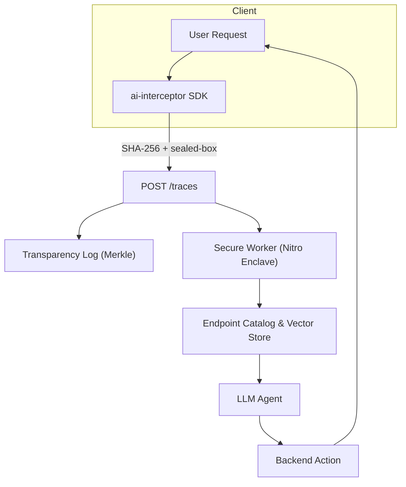

# @wapy-ai/interceptor

> **End‑to‑end‑encrypted traces & AI‑powered actions for any Node.js backend**

`interceptor` is an SDK that lets you _opt‑in_ specific routes or resolvers and send their payloads—fully encrypted—to **AI Cloud**. There they become callable *tools* for an LLM (e.g. `createTag`).

* **Opt‑in** – you decide exactly which endpoints are observed.
* **E2EE** – sealed with _libsodium sealed‑box_; only you own the *private key*.
* **Transparency** – every SHA‑256 hash is appended to a tamper‑evident Merkle log.
* **Near‑zero latency** – adds ~1 ms p99.

---

## ⚙️ How it works


1. **Intercept** request/response.
2. Compute `sha256(body)` and encrypt with your _public key_.
3. Send to `/traces`; the hash becomes a *leaf* in a transparency log.
4. A worker running inside an **AWS Nitro Enclave** decrypts, infers the schema and registers a _tool_.
5. When the end‑user asks, the LLM calls `createTag` with the right parameters.

---

## 🔒 Security deep dive

| Layer | Guarantee | Tech |
|-------|-----------|------|
| Confidentiality | Only the *private key* holder can read the payload | `crypto_box_seal` (libsodium) |
| Integrity | Any bit flip is detected | `sha256` header + Merkle proof |
| Immutability | Events cannot be removed or rewritten | Trillian log + S3 Object‑Lock |
| Confined execution | Embedding worker can’t leak data | AWS Nitro Enclaves + attestation |

### Self‑audit in 3 steps

```bash
# 1 – Dump ciphertext + proofs
aicli dump --from 2025‑04‑01 --to 2025‑04‑02 > dump.enc
# 2 – Decrypt with your private key
openssl pkeyutl -decrypt -inkey priv.key -in dump.enc > dump.json
# 3 – Verify hash & Merkle proof
aicli verify dump.json dump.proof root.json   # ✅ All good
```

---

## 🚀 Installation

```bash
npm i @wapy-ai/interceptor        # or pnpm / yarn
```

> **Peer deps** (install only if you use them):
> * express ^4 | ^5
> * fastify ^4
> * @nestjs/common ^10
> * rxjs ^7 (required by Nest)

---

## ✨ Quick Start

### 1. Generate keys

```bash
openssl genpkey -algorithm X25519 -out priv.key
openssl pkey -in priv.key -pubout -out pub.key
curl -X POST https://ingest.wapy.com.br/tenants/{id}/keys \
     --data-binary @pub.key \
     -H "Authorization: Bearer <token>"
```

### 2. Express example

```ts
import express from 'express'
import { aiInterceptor } from '@wapy-ai/interceptor'
import { z } from 'zod'

const app = express()
app.use(express.json())

app.post(
  '/tags',
  aiInterceptor({
    apiKey: process.env.AI_KEY!,
    publicKey: Buffer.from(process.env.AI_PUB!, 'base64'),
    name: 'createTag',
    schema: z.object({ name: z.string(), color: z.string().optional() })
  }),
  (req, res) => res.json({ ok: true })
)

app.listen(3000)
```

### 3. NestJS decorator

```ts
@Post('tags')
@AiIntercept({
  apiKey: process.env.AI_KEY!,
  publicKey: Buffer.from(process.env.AI_PUB!, 'base64'),
  name: 'createTag'
})
create(@Body() dto: CreateTagDto) {
  return this.service.create(dto)
}
```

### 4. Fastify hook

```ts
fastify.post('/tags', {
  preHandler: aiFastify({ apiKey, publicKey, name: 'createTag' })
}, async (_req, _res) => ({ ok: true }))
```

---

## 🛠️ API Reference

### `AIOptions`

| Field | Type | Req | Description |
|-------|------|-----|-------------|
| `apiKey` | `string` | ✅ | Identifies your tenant in AI Cloud |
| `publicKey` | `Uint8Array` | ✅ | X25519 key **bytes** (32 B) |
| `name` | `string` | ✅ | Action alias (e.g. `createTag`) |
| `schema` | `ZodSchema` | – | JSON Schema for params (builds the tool) |
| `redact` | `(key, value)=>boolean` | – | Return `true` to mask before hashing |

### Exported adapters

```ts
aiInterceptor // Express / Koa
aiFastify     // Fastify hook
AiIntercept()  // NestJS decorator
```

---

## 🧹 Redaction plugin example

```ts
const cpf = /\b\d{3}\.\d{3}\.\d{3}-\d{2}\b/
redact: (k, v) => typeof v === 'string' && cpf.test(v as string)
```
Fields returning `true` are replaced by `"***REDACTED***"` before hashing + encryption.

---

## ❓ FAQ

**Can I use it with GraphQL?** Soon. A `wrapWithAI(resolver, opts)` helper is on the roadmap.

**How big is the overhead?** ≈ 750 B per trace + 0.8 ms p95 in local benchmarks.

**What if AI Cloud is down?** The interceptor never blocks your route; traces are queued and retried in the background.

---

## 📜 License

MIT — free to use, PRs welcome!

